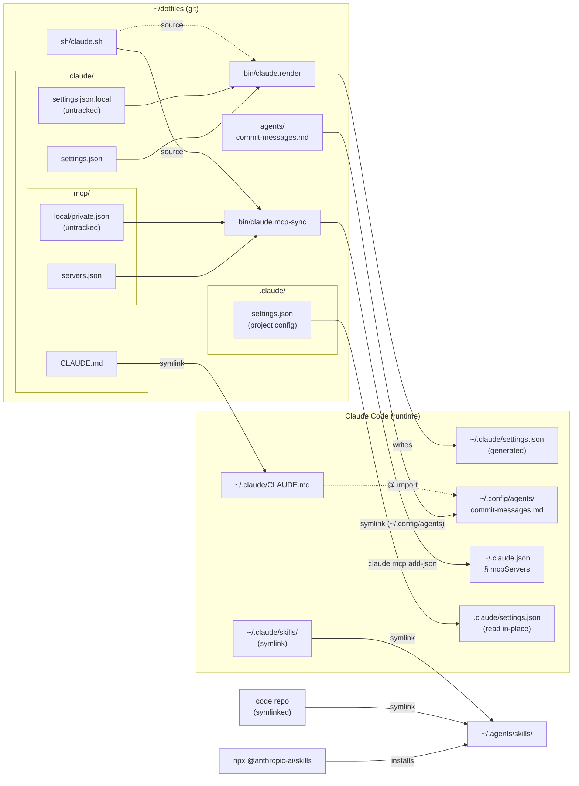

# dotfiles

My dotfiles

- [Set up macOS](#set-up-macos)
  - [Set Hostname](#set-hostname)
  - [Create SSH Key](#create-ssh-key)
  - [Set up](#set-up)
  - [Installing LanguageTool](#installing-languagetool)
- [Setting up on Windows 7](#setting-up-on-windows-7)
- [Setting up Babun/Cygwin](#setting-up-babuncygwin)
- [RHEL/CentOS 7](#rhelcentos-7)
- [Setting up Ubuntu GNOME 14.04](#setting-up-ubuntu-gnome-1404)
- [Setting up a new Ubuntu 12.04 system](#setting-up-a-new-ubuntu-1204-system)

## Set up macOS

### Set Hostname

```shell
export HOSTNAME="<PICK SOMETHING>"
```

### Create SSH Key

1. Generate SSH Key: `ssh-keygen -t ed25519 -a 100 -C "$(whoami)@${HOSTNAME}"`
1. Copy public key, log into GitHub, and upload key:
   `cat ~/.ssh/id_ed25519.pub | pbcopy`
1. Install SSH key in `ssh-agent`: `ssh-add`

### Set up

1. Install Command-line Developer Tools (running `git` will prompt you to do this)

1. `git clone git@github.com:gtback/dotfiles.git`

1. `./dotfiles/install.sh`

1. Install latest Homebrew from [`.pkg` installer](https://github.com/Homebrew/brew/releases/).

1. Restart Shell

1. `brew.up` (this will take a while)

1. Set up vim: `./dotfiles/setup_vim.sh`

1. Create `dotfiles/git/config.local`:

   ```ini
   [user]
      name = Greg Back
      email = <email address to use for Git commits on this machine>
   ```

1. Install `pipx` packages: `pipx.up`

1. Set up `pre-commit` in `dotfiles` repo: `pre-commit install`

1. Configure macOS defaults:

   ```shell
   defaults write NSGlobalDomain com.apple.keyboard.fnState -bool true
   defaults write NSGlobalDomain com.apple.swipescrolldirection -bool false
   defaults write NSGlobalDomain AppleShowAllExtensions -bool true
   defaults write com.apple.menuextra.clock.plist ShowSeconds -bool true
   defaults write com.apple.dock "tilesize" -int "16"
   defaults write com.apple.dock "orientation" -string "right"
   defaults write com.apple.dock "autohide" -bool "true"
   defaults write com.apple.dock "show-recents" -bool "false"
   defaults write com.apple.dock "static-only" -bool "true"
   killall Dock
   defaults write com.apple.finder "AppleShowAllFiles" -bool "true"
   defaults write com.apple.finder "ShowPathbar" -bool "true"
   killall Finder
   mac.set_hostname "${HOSTNAME}"
   ```

1. Install latest Python from python.org: `mopup --force true`

1. Copy files from old machine to new machine:

    - [`mcfly` database](https://github.com/cantino/mcfly#database-location)

1. Restart Machine

1. Set up Python:

   ```shell
   /usr/local/bin/python3 -m pip install --upgrade pip setuptools wheel
   /usr/local/bin/python3 -m pip install virtualenv virtualenvwrapper
   ```

   `virtualenv` and `virtualenvwrapper` are installed in the Homebrew Python 3
   (this is the `system` Python to `mise`/`asdf`/`pyenv`). When a new minor
   version of Python is released to Homebrew, these need to be re-installed.

1. Install language runtimes with [`mise`](https://mise.jdx.dev/):

   ```shell
   mise install
   ```

1. Set up [pi](https://pi.dev/) MCP servers (requires 1Password CLI signed in):

   ```shell
   pi.mcp-render
   ```

   Then launch `pi` once to trigger package installation
   (`@plannotator/pi-extension`, `pi-mcp-extension`).

   **First time on a new machine:** migrate any existing `~/.pi/agent` state
   to XDG before running `install.sh`:

   ```shell
   mkdir -p "$XDG_CONFIG_HOME/pi/agent" "$XDG_DATA_HOME/pi/sessions" "$XDG_DATA_HOME/pi/packages"
   mv ~/.pi/agent/auth.json ~/.pi/agent/models-store.json "$XDG_CONFIG_HOME/pi/agent/" 2>/dev/null || true
   rm -rf ~/.pi
   ```

1. Set up Claude Code user settings and MCP servers:

   ```shell
   # First time only: adopt the existing ~/.claude/settings.json into the layer system
   claude.render --force

   # Create machine-local layers (not committed):
   #   claude/settings.json.local  — additionalDirectories, machine-specific allow rules
   #   claude/mcp/local/*.json     — MCP server definitions (e.g. elastic.json)
   # Then sync user-scope MCP servers:
   claude.mcp-sync
   ```

1. Compile custom `nnn` with Nerd Font support:

   ```shell
   mkdir -p ~/code
   cd ~/code
   git clone git@github.com:jarun/nnn.git
   make O_NERD=1
   mv ./nnn ~/bin
   ```

### Installing LanguageTool

See Ben Balter’s [blog post][] to get started.

Set up n-grams data:

```shell
cd ~/tmp || exit
wget https://languagetool.org/download/ngram-data/ngrams-en-20150817.zip
unzip ngrams-en-20150817.zip
mkdir $XDG_DATA_HOME/ngrams
mv en $XDG_DATA_HOME/ngrams
rm ngrams-en-20150817.zip
brew services restart languagetool
```

To get logs from LanguageTool:

```shell
tail -f ${LOCAL_HIERARCHY}/var/log/languagetool/languagetool-server.log
```

TODO: Add `api.languagetool.org` to a DNS block list at the system level
(hosts file, Little Snitch, etc.)

References:

- [`com.apple.keyboard.fnState`](https://macos-defaults.com/misc/applekeyboardfnstate.html#set-to-true)

[blog post]: https://ben.balter.com/2025/01/30/how-to-run-language-tool-open-source-grammarly-alternative-on-macos/

## Claude



## Setting up on Windows 7

This is not a complete guide, just a few hints.

1. Clone repo to $HOME directory
2. Copy files from `windows` directory to $HOME directory

## Setting up Babun/Cygwin

1. Install [Babun](https://babun.github.io/)
1. Install Source Code Pro font [modified for Powerline](https://github.com/powerline/fonts/tree/master/SourceCodePro).
1. Configure Babun to use `Sauce Code Powerline` font.
1. Create SSH key (`ssh-keygen -t rsa -b 4096`) and upload to GitHub.
1. Update `.babunrc` file as needed (proxies, user agent, etc.).
1. Reload `.babunrc` and verify Network connectivity and available updates.

   ```sh
   source .babunrc
   babun check
   ```

1. Clone dotfiles and run installation scripts.

   ```sh
   cd $HOME
   git clone git@github.com:gtback/dotfiles.git
   mv .zshrc .zshrc.bak
   mv .gitconfig .gitconfig.bak
   dotfiles/setup_env.py
   dotfiles/setup_vim.sh
   ```

1. Customize local installation.

   ```sh
   git config -f .gitconfig.local user.name "Greg Back"
   git config -f .gitconfig.local user.email gtback@users.noreply.github.com
   ```

1. Launch a new terminal to reload ZSH settings. If you get error messages, you
   can try updating the completion files. Note that the file containing
   `<COMPUTER NAME>` should already exist; replace that file.

   ```sh
   compinit -y
   cp .zcompdump .zcompdump-<COMPUTER NAME>-5.0.6
   ```

1. Set up pip, virtualenvwrapper, and pipsi.

   ```sh
   curl https://bootstrap.pypa.io/get-pip.py | python
   pip install virtualenvwrapper
   curl https://raw.githubusercontent.com/mitsuhiko/pipsi/master/get-pipsi.py | python
   ```

1. Install other desired packages

   ```sh
   pact install tmux
   ```

## RHEL/CentOS 7

```shell
sudo yum -y update

ssh-keygen

git config --file ~/.gitconfig.local user.email "gtback@users.noreply.github.com"
git config --file ~/.gitconfig.local user.name "Greg Back"

git clone git@github.com:gtback/dotfiles.git
python dotfiles/setup_env.py
source dotfiles/setup_vim.sh

sudo yum -y install zsh
chsh -s /bin/zsh

git clone https://github.com/robbyrussell/oh-my-zsh.git ~/.oh-my-zsh
git clone https://github.com/zsh-users/zsh-syntax-highlighting.git ${ZSH_CUSTOM:-~/.oh-my-zsh/custom}/plugins/zsh-syntax-highlighting
sudo yum -y install yum-utils
sudo yum -y groupinstall development
sudo yum install -y https://dl.fedoraproject.org/pub/epel/epel-release-latest-7.noarch.rpm
sudo yum -y install https://centos7.iuscommunity.org/ius-release.rpm
sudo yum -y install python36u python36u-pip python36u-devel

wget https://github.com/github/hub/releases/download/v2.4.0/hub-linux-amd64-2.4.0.tgz
tar xf hub-linux-amd64-2.4.0.tgz
sudo ./hub-linux-amd64-2.4.0/install

git clone https://github.com/yyuu/pyenv.git ~/.pyenv
sudo yum -y install zlib-devel readline-devel bzip2-devel sqlite-devel openssl-devel
pyenv install 2.7.15
pyenv install 3.6.5
echo "3.6.5\n2.7.15\nsystem\n" > ~/.pyenv/version
pyenv rehash

/usr/bin/pip3.6 install --user virtualenvwrapper
curl https://raw.githubusercontent.com/mitsuhiko/pipsi/master/get-pipsi.py | /usr/bin/python3.6
pipsi install twine
pyenv rehash

# To verify virtualenwrapper is installed correctly, run the `workon` command.
```

## Setting up Ubuntu GNOME 14.04

```sh
sudo apt-get update
sudo apt-get upgrade
sudo apt-get install -y build-essential cmake curl git python-dev tmux vim vim-gnome xclip zsh

ssh-keygen
```

Upload `~/.ssh/id_rsa.pub` to GitHub.

```sh
git config --file ~/.gitconfig.local user.email "gtback@users.noreply.github.com"
git config --file ~/.gitconfig.local user.name "Greg Back"

cd $HOME
git clone git@github.com:gtback/dotfiles.git
python dotfiles/setup_env.py

# Vim Setup
source dotfiles/setup_vim.sh
$HOME/.vim/bundle/YouCompleteMe/install.py

# Oh-my-zsh setup
cd $HOME
chsh -s `command -v zsh`
git clone https://github.com/robbyrussell/oh-my-zsh.git ~/.oh-my-zsh
git clone https://github.com/zsh-users/zsh-syntax-highlighting.git ${ZSH_CUSTOM:-~/.oh-my-zsh/custom}/plugins/zsh-syntax-highlighting

# Python setup
git clone https://github.com/yyuu/pyenv.git ~/.pyenv
sudo apt-get install -y libbz2-dev libncurses5-dev libreadline-dev libsqlite3-dev libssl-dev llvm wget zlib1g-dev
pyenv install 2.7.11
pyenv install 3.5.1
pyenv rehash
echo "2.7.11\n3.5.1\nsystem\n" > ~/.pyenv/version

# Log out and back on to update Shell settings

~/.pyenv/versions/2.7.11/bin/pip install virtualenvwrapper

# Pipsi setup
pyenv rehash
curl https://raw.githubusercontent.com/mitsuhiko/pipsi/master/get-pipsi.py | ~/.pyenv/versions/2.7.11/bin/python
pipsi install autopep8
pipsi install flake8
pipsi install httpie
pipsi install pep8
pipsi install pylint
pipsi install tmuxp
pipsi install tox
pipsi install twine

# Terminal Colors and Fonts
# Create a new Terminal Profile and use it for all modifications below.
cd $HOME
mkdir src
cd src
git clone https://github.com/gnumoksha/gnome-terminal-colors
gnome-terminal-colors/install.sh

git clone https://github.com/powerline/fonts.git powerline-fonts
powerline-fonts/install.sh
# Configure the Terminal Profile to use  `Sauce Code Powerline Medium.otf`
```

Log out and back in to ensure changes have taken effect.

## Setting up a new Ubuntu 12.04 system

These are some steps I performed when setting up a new Ubuntu 12.04 system
recently.

```shell
add-apt-repository ppa:fkrull/dead-snakes
add-apt-repository ppa:git-core/ppa
add-apt-repository ppa:pi-rho/dev

apt-get install curl git openssh-server python-pip tmux vim vim-gnome zsh

git clone https://github.com/gtback/dotfiles.git
cd dotfiles
python setup_env.py
source setup_vim.sh

cd ~
ssh-keygen -t rsa
chsh -s `command -v zsh`
git clone https://github.com/robbyrussell/oh-my-zsh.git ~/.oh-my-zsh

sudo pip install -U pip
sudo pip install virtualenvwrapper
sudo pip install tmuxp
pip install --user https://github.com/Lokaltog/powerline/archive/develop.zip

wget https://github.com/Lokaltog/powerline-fonts/raw/master/Inconsolata/Inconsolata%20for%20Powerline.otf
```
